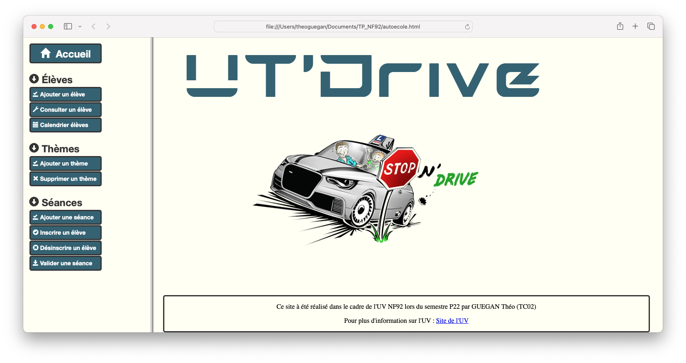

# **Auto-Ecole Web Platform**

## **Description**
This project is a basic web platform designed for a school project aiming to re-create a driving school website, built using **HTML**, **CSS**, and **PHP**. The main focus of this site is handling user data via forms and interacting with a SQL database managed through **phpMyAdmin**. It includes functionalities such as user registration, login systems, and basic administrative features for managing students and instructors.

## **Features**
- User registration and authentication
- SQL database management via phpMyAdmin
- Basic CRUD (Create, Read, Update, Delete) operations for user data